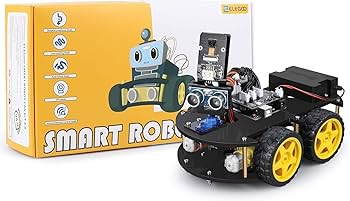
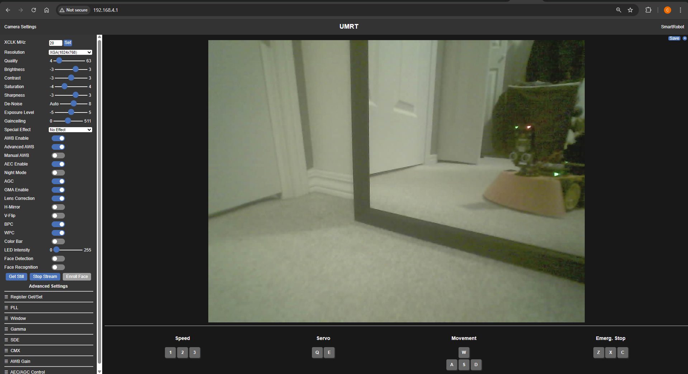
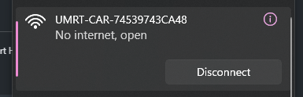

# umrt-outreach-robotcar-wireless - elegoo-kit-face
Showcase program for the outreach car with wireless camera and control with the Elegoo Smart Robot Car Kit v4.0

The UI lets you control the car using the arrow keys and displays a POV through the car's camera.
The UI also contains 3 text boxes intended for kids to decipher hidden messages and enter them into the computer. If the password is correct, the UI will display success, on fail it will display "access denied".

## elegoo-kit-face
This branch uses a modified version of the Elegoo Smart Robot Kit, replacing the ultrasonic sensor with an I2C OLED 128x64 Display.

<!--  -->


This branch also contains the 3D printable files needed for the display modification.

### Additional Materials:
* I2C OLED Display 128x64
* 4x pin wires male to female


The smart robot car kit shield contains a pin header for the gyroscope, which contains I2C communication pins A4 and A5. The gyroscope is not used in this program, so you can remove the gyroscope and use the pin header for OLED communication.

<!--  -->


### Elegoo Smart Robot Car Kit v4.0



### Customized UI




Has programs for:
* ESPCAM wireless webserver
* Robot car controller


## Source Code
[ELEGOO Smart Robot Car Kit v4.0 Tutorial](https://www.elegoo.com/blogs/arduino-projects/elegoo-smart-robot-car-kit-v4-0-tutorial?srsltid=AfmBOoqMivfDJrTS4gy-7ch7kX_ipVF3AapzQ6OrKHgQfm_FXfPVEX2j)
* Contains base code for motor controller - Be sure to check **Project Specifics**!

[ELEGOO Smart Robot Car V4.0 with Camera: Upload code to the camera module](https://www.elegoo.com/blogs/learn/elegoo-smart-robot-car-v4-0-with-camera-upload-code-to-the-camera-module?srsltid=AfmBOorwSPXrGH27v5DquohfgNhWwHpXve6odx9NIjyzJDFCGTwSDMKD)
* Contains **UPDATED** camera code for the ESP32S3 Camera V1.0.

## Project Specifics
The template programs change depending on your specific parts. 
* ESP Camera: ```Elegoo ESP32S3 Camera v1.0```
* Motor Driver: ```TB6612```
* Gyro Module: ```MPU6050```


# SmartRobotCarV4.0_V1_20230201
Arduino IDE Configuration:
* Board: ```Arduino UNO```

Nothing much has changed from the template code given by Elegoo


<!-- ## ESP Camera Arduino IDE Setup -->
# ESP32_CameraServer_AP_2023_v1.3
Arduion IDE Configuration:
* Board Manager > Install ```esp32 by Espressif Systems v2.0.14```
* Configure Tools:
  * Board: ```ESP32S3 Dev Module```
  * USB CDC On Boot: ```Enabled```
  * Flash Size: ```8MB (64Mb)```
  * Partition Scheme: ```8M with spiffs (3MB APP/1.5MB SPIFFS)```
  * PSRAM ```OPI PSRAM```

The program creates a REST API to send json through to UART to the Arduino Uno to control the motors.

The served HTML handles all of the controls functionality. Based on the input, it will send json commands to the camera which forwards it to the robot car controller. The HTML file itself is stored as compressed GZ bytes under `camera_index.h`. To convert between a working HTML file and compressed bytes, use `converter.py`


## converter.py
Quick tool to convert HTML into compressed GZ bytes

To compress **camera_index.html** into **camera_index.h**
```
> python ./converter.py html_to_txt
```


`camera_index.h` and its variables are referenced during compilation, which stores all of the compressed HTML files.

To run the decompression process (`camera_index.h` to `camera_index.html`):
```
> python ./converter.py txt_to_html
```


# Usage
1. Turn on the power supply on the car, which powers both the car controller and the camera
2. Connect to the wifi called ```UMRT-CAR-XXXXXXXXXXXX```



3. Open a browser and connect to ```194.168.4.1```
4. Configure settings by clicking the text in the top left
5. control the robot with your keyboard
  
| Key | Command |
|---|-----|
| Up | Move Forward |
| Down | Move Backward |
| Left | Turn Left |
| Right | Turn Right |
| Z, X, C | Emergency Stop |

## Troubleshooting:
If input is a little laggy, try turning it off and on again
