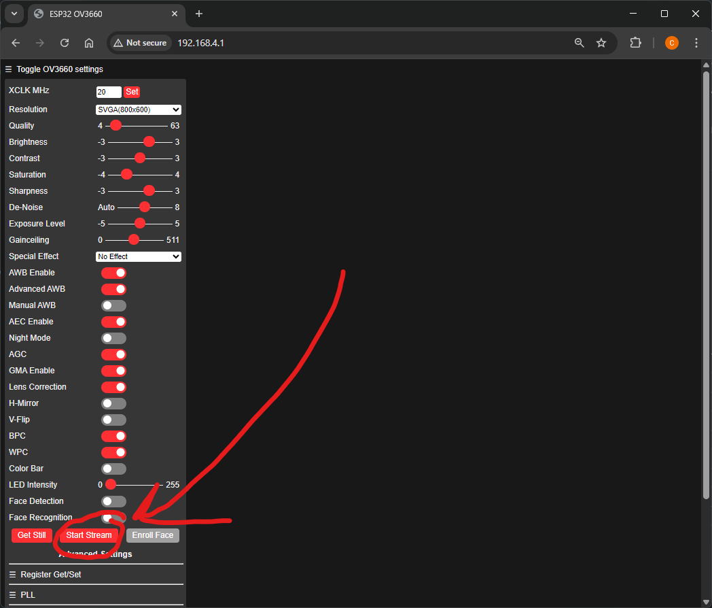

# umrt-outreach-robotcar-wireless

Showcase program for the outreach car with wireless camera and control with the Elegoo Smart Robot Car Kit v4.0

Has programs for:
* ESPCAM wireless webserver
* Robot car controller


## Source Code
[ELEGOO Smart Robot Car Kit v4.0 Tutorial](https://www.elegoo.com/blogs/arduino-projects/elegoo-smart-robot-car-kit-v4-0-tutorial?srsltid=AfmBOoqMivfDJrTS4gy-7ch7kX_ipVF3AapzQ6OrKHgQfm_FXfPVEX2j)
* Contains base code for motor controller - Be sure to check **Project Specifics**!

[ELEGOO Smart Robot Car V4.0 with Camera: Upload code to the camera module](https://www.elegoo.com/blogs/learn/elegoo-smart-robot-car-v4-0-with-camera-upload-code-to-the-camera-module?srsltid=AfmBOorwSPXrGH27v5DquohfgNhWwHpXve6odx9NIjyzJDFCGTwSDMKD)
* Contains **UPDATED** camera code for the ESP32S3 Camera V1.0.

## Project Specifics
The template programs change depending on your specific parts. 
* ESP Camera: ```Elegoo ESP32S3 Camera v1.0```
* Motor Driver: ```TB6612```
* Gyro Module: ```MPU6050```


<!-- ## ESP Camera Arduino IDE Setup -->
# ESP32_CameraServer_AP_2023_v1.3
Arduion IDE Configuration:
* Board Manager > Install ```esp32 by Espressif Systems v2.0.14```
* Configure Tools:
  * Board: ```ESP32S3 Dev Module```
  * USB CDC On Boot: ```Enabled```
  * Flash Size: ```8MB (64Mb)```
  * Partition Scheme: ```8M with spiffs (3MB APP/1.5MB SPIFFS)```
  * PSRAM ```OPI PSRAM```


The served HTML handles all of the controls functionality. Based on the input, it will send json commands to the camera which forwards it to the robot car controller. The HTML file itself is stored as compressed GZ bytes under `camera_index.h`. To convert between a working HTML file and compressed bytes, use `converter.py`


## converter.py
Quick tool to convert HTML into compressed GZ bytes
#### Usage:
```
> python ./converter.py html_to_txt
```

Compresses **index_ov3660.html** into **index_ov3660_html_gz.txt**. It labels the variables as `index_ov3660_html_gz_CEP` and `index_ov3660_html_gz_len_CEP`.
Now you can copy and paste (and replace) the variables at the bottom of `camera_index.h` which stores all of the compressed HTML files.

```
> python ./converter.py txt_to_html
```
The decompression process if desired.


# SmartRobotCarV4.0_V1_20230201
Arduino IDE Configuration:
* Board: ```Arduino UNO```

Nothing much has changed from the template code given by Elegoo


# Usage
1. Turn on the power supply on the car, which powers both the car controller and the camera
2. Connect to the wifi called ```umrt-car-XXXXXXXXXXXX```

3. Open a browser and connect to ```194.168.4.1```
4. Click ```Start Stream``` to view live camera

5. Configure the camera settings or control the robot with your keyboard
  
| Key | Command |
|---|-----|
| W | Move Forward |
| S | Move Backward |
| A | Turn Left |
| D | Turn Right |
| Q | Turn Camera Left 30 deg |
| E | Turn Camera Right 30 deg |
| 1 | Set Speed LOW (55) |
| 2 | Set Speed MED (155) |
| 3 | Set Speed HIGH (255) |
| Z, X, C | Emergency Stop |

## Troubleshooting:
If input is a little laggy, try turning it off and on again
